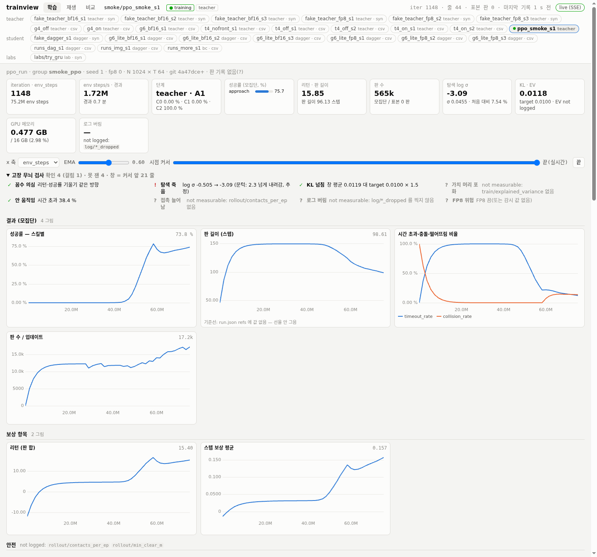
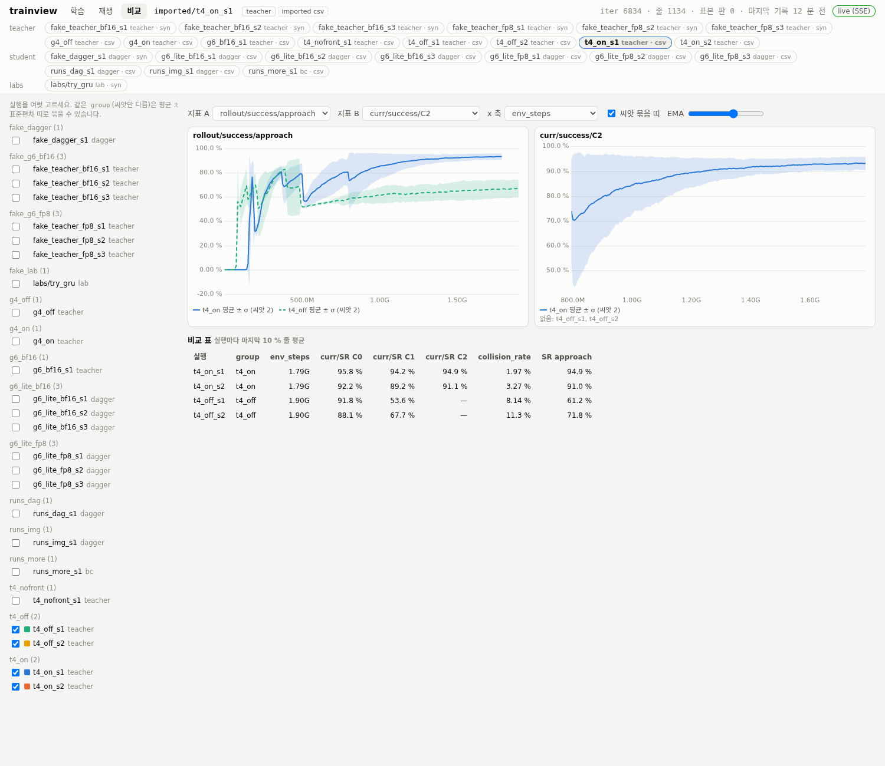

<div align="center">

<h2>
  <picture>
    <source media="(prefers-color-scheme: dark)" srcset="docs/assets/icon-bot-dark.svg">
    
  </picture>
  우리는 물체를 기억하는 로봇을 만든다 - 자유주제
</h2>

<a href="https://plausible-hallway-e4f.notion.site/3eb454b08de28190b2e8e321a33a9371">팀 노션</a> &nbsp;·&nbsp; <a href="docs/plan.md">계획</a> &nbsp;·&nbsp; <a href="docs/model_selection.md">모델 선택</a> &nbsp;·&nbsp; <a href="refs/README.md">참고 자료</a>

<br><br>


<sub>로봇의 물체 기억(MIT Spark-DSG를 수정해 사용) 뷰어 — 2D 지도 위에 물체를 세그먼트 점구름으로 등록하고, 누르면 위치·상태와 그 물체를 본 순간의 RGB·깊이 조각을 보여 준다 (BEHAVIOR 시뮬레이션, 3배속)</sub>

<br><br>


<sub>실제 로봇 데이터(OpenLORIS-Scene, CC BY-ND 4.0)에 우리 인지 파이프라인(검출 + scenemap SLAM·물체 기억·장면 그래프)을 돌린 모습, 3배속 — office1-5, 바퀴 오도메트리 + 깊이 스캔 맞추기. 오른쪽 위 작은 창은 bag 의 RGB 원본 프레임(크기만 줄이고 고치지 않음). 데이터: X. Shi et al., "Are We Ready for Service Robots? The OpenLORIS-Scene Datasets for Lifelong SLAM", ICRA 2020 (<a href="https://lifelong-robotic-vision.github.io/dataset/scene">OpenLORIS-Scene</a>, iVip Tsinghua · Intel). <a href="docs/assets/realbag_openloris_office.mp4">MP4</a> · 잰 값은 <a href="docs/map_vla/MAP_STATE_PLAN.md">MAP_STATE_PLAN</a> "실제 데이터"</sub>

<br><br>

<table>
<tr>
<td align="center" width="50%"></td>
<td align="center" width="50%"></td>
</tr>
<tr>
<td align="center"><sub>BEHAVIOR Challenge 2026 시뮬레이터(OmniGibson)에서 로봇이 라디오를 집어 켜는 모습 (turning_on_radio, 6배속)</sub></td>
<td align="center"><sub>리모 + 매니퓰레이터 URDF 를 RViz 에 띄운 모습 (TF 프레임 표시)</sub></td>
</tr>
<tr>
<td align="center" width="50%"></td>
<td align="center" width="50%"></td>
</tr>
<tr>
<td align="center"><sub>학습 뷰어(<a href="training/viewer">trainview</a>, Rust 서버 + 브라우저) — GPU 안에서 도는 RL 교사 학습을 실시간으로(성공률·판 길이·충돌·보상·고장 무늬 검사)</sub></td>
<td align="center"><sub>같은 뷰어의 비교 탭 — 지도 토큰 켬/끔 교사를 씨앗 둘씩 평균 ± σ 띠로 비교(가구가 막는 A2, 빈 지도 C2 성공률)</sub></td>
</tr>
</table>

</div>

<br>

로봇이 집 안을 돌아다니며 본 물체를 기억해 둔다. 그래서 사람이 물체를 찾거나 옮겨 달라고 하면, 어디 있는지 다시 뒤지지 않고 기억을 떠올려 바로 움직인다.

## 이런 걸 할 수 있어요

| 사람이 말하면 | 로봇은 |
|---|---|
| "컵 어디 있었지?" | 기억에서 찾아 "주방 식탁 위에 있었어요" 라고 답한다 |
| "컵을 식탁에 갖다 놔" | 컵 위치로 이동 → 집기 → 식탁으로 이동 → 놓기 |
| (누가 컵을 옮겨 놓으면) | 다음에 봤을 때 기억을 새 위치로 고친다 |
| (중간에 집기를 실패하면) | 다시 확인하고 재시도한다 |

## 어떻게 동작하나요

```
카메라·라이다 ──▶ ① 물체 기억 (scene graph) ──▶ ② 큰 계획·대화 (LLM) ──▶ ③ 작은 계획·행동 (우리 VLA) ──▶ 로봇
                   "무엇이 어디에 있나"          "무엇을 어떤 순서로"           "지금 이 단계를 어떻게"
                          ▲                                                                   │
                          └─────────────────────── 움직이며 본 것으로 기억 갱신 ◀─────────────┘
```

1. **물체 기억** — 로봇이 본 물체를 2D 지도 위에 등록하고, 옮겨지거나 사라지면 고친다.
2. **큰 계획·대화 (LLM)** — 사람과 채팅으로 대화하고, 물체 기억을 읽어 VLA 에게 상황을 풀어 준다 ("컵은 주방 식탁 위, 놓을 곳은 거실 식탁"). 물체가 화면 밖으로 벗어나 VLA 가 움직일 수 없으면, 기억을 보고 다시 계획한다.
3. **작은 계획·행동 (VLA)** — LLM 의 지시와 카메라 영상을 받아, 할 일을 잘게 나눠(팔 뻗기 → 잡기 → 들기) 로봇 팔·바퀴를 실제로 움직인다. 집다가 놓치는 것처럼 눈앞에서 생긴 실패는 스스로 복구한다.
   - VLA 는 π0.5 가 아니라 **우리가 만든 VLA** 다(10-04, π0.5 는 버림). 본 모델은 **RecallVLA**(Qwen3.5-0.8B 전부 학습 + SigLIP 2 + 물체 기억 → 단계 문장 + 행동, [사양](docs/map_vla/MAPVLA_SPEC.md), 학습기 [`training/vla`](training/vla/README.md) — 큰 학습은 아직). 지금 도는 작은 학생은 얼린 SigLIP 2 영상 탑 + 물체 기억 지도 토큰 + 지시 문장 → flow matching 행동이고, 시뮬 RL·대본 교사에게서 BC·DAgger 로 배운다([`training/BC`](training/BC/README.md)).

## 로봇

AgileX 리모(LIMO) 기본형(가정, **프로를 받을 수도 있음**) + 매니퓰레이터 ROBOTIS OMX-F. 자세한 전제와 할 일은 [`docs/plan.md`](docs/plan.md).

## 폴더 구조

```
robot-agent/
├── docs/            # 계획(plan.md), 모델 선택, 후보 조사, Map_Vla 설계(map_vla/) (목록은 docs/README.md)
├── src/             # 코드 (ROS 2 패키지)
│   ├── robot/       # 리모 + 매니퓰레이터(OMX-F) 로봇 설명(URDF·RViz)
│   ├── scene_graph/ # ① 물체 기억 (scenemap·da·spark_dsg·sgview·runtime·ovdet·clip, behavior-2026 에서 tools/sync_scene_graph.sh 로 맞춤)
│   ├── agent/       # ② 큰 계획·대화 (LLM)·실패 복구
│   │   ├── skills/  #   스킬(한 가지 일을 끝까지 하는 단위, 지금은 explore)
│   │   ├── tools/   #   LLM 에게 보이는 도구(move_robot, Rust)
│   │   └── prompts/ #   공통 프롬프트
│   ├── vla/         # ③ 작은 계획·행동 (우리 VLA — 지금은 README 만, 학습 코드는 training/vla·training/BC)
│   ├── app/         # 휴대폰 앱 (iOS·Android, 채팅으로 명령)
│   └── behavior-2026/ # 서브모듈: BEHAVIOR Challenge 2026 (시뮬레이터에서 같은 구조를 시험)
│       ├── src/scene_graph/ # 물체 기억 원본: scenemap·da·ovdet·clip(물체 영상 임베딩)·runtime(sgrt)·sgview
│       │                    #   뷰어 = sgview(Rust, 실시간): tools/run_sgview.sh · tools/run_explore_live.sh. viewer/(sgviz, Python)는 옛 뷰어(실시간 아님, 안 씀)
│       │                    #   spark_dsg/: Spark-DSG 우리 수정본 (BSD-3, 층 3개로 줄임 · mesh/zmq 제거)
│       ├── tools/   #   실행·측정·검증 스크립트
│       └── archive/ #   지금 안 쓰는 모듈 (지우지 않고 옮겨 둠)
├── training/        # 모델 학습 (embed/: 영상–글 임베딩 증류, RL/·BC/: 교사·작은 학생, vla/: RecallVLA, fastsam/: ObjectSAM 분할, viewer/: 학습 뷰어, model/: 베이스 모델)
├── scripts/         # 설치·실행 스크립트
├── tools/           # sync_scene_graph.sh (behavior-2026 → src/scene_graph 동기화)
├── tests/           # 테스트 (sandbox/ 는 AI·사람 실험 공간)
└── refs/            # 참고 논문·코드 목록
```

## 문서

- [docs/README.md](docs/README.md) — 이 저장소 문서 목록
- [docs/clip_candidates.md](docs/clip_candidates.md) — CLIP 류 임베딩 모델 후보·측정
- [docs/map_vla/README.md](docs/map_vla/README.md) — Map_Vla(리모 + 매니퓰레이터 VLA) 설계 문서
- [src/scene_graph/README.md](src/scene_graph/README.md) — 물체 기억 코드(실제 로봇 쪽)·동기화·빌드
- [src/robot/README.md](src/robot/README.md) — 리모 + 매니퓰레이터 로봇 설명(URDF·RViz)
- [training/README.md](training/README.md) — 모델 학습(교사·학생·RecallVLA·분할·학습 뷰어)
- [scenemap 설계](https://github.com/juyoung020/behavior-2026/blob/main/docs/scenemap_설계.md) — 물체 기억(2D SLAM·물체 지도·계획기 질의) 설계 (서브모듈)
- [archive/README.md](https://github.com/juyoung020/behavior-2026/blob/main/archive/README.md) — 지금 안 쓰는 모듈: 무엇을, 왜, 어떻게 되살리나 (서브모듈)
- [tools/README.md](https://github.com/juyoung020/behavior-2026/blob/main/tools/README.md) — 실행·측정·검증 스크립트 (서브모듈)

## 정한 것

- 이미지 임베딩: SigLIP 2 B/32.
- 분할(10-05 결정): ObjectSAM(FastSAM-s 에서 증류한 YOLO26n 학생, things 만 — 엔진 `yolo26n-seg-obj-416`, [github.com/juyoung020/ObjectSAM](https://github.com/juyoung020/ObjectSAM) v1.0) + SigLIP 2 + objprob(scenemap 확률 모드, 기본 켬, 매개변수 `objprob_params/yolo26n-seg-obj-416.json`), 입력 416. 까닭: FastSAM-s 계산의 약 1/10 이라 LIMO 의 Jetson(특히 Nano)에 맞다 — 기기 위 시간은 아직 안 잼.
- 물체 벡터는 원본 임베딩 그대로 두고, 이름은 기억 폴더의 `cache/` 에 둔다.
- CUDA 12.8.
- 지도 자세: `SGRT_POSE` 로 고른다(`slam`·`odom`·`gt`, 실제 로봇 기본 `slam`, 시뮬 시험은 `gt`).

## BEHAVIOR Challenge 2026 (서브모듈)

[`src/behavior-2026`](https://github.com/juyoung020/behavior-2026) 은 같은 구조(물체 기억 + LLM 계획 + VLA)를 Stanford BEHAVIOR Challenge 2026 시뮬레이터(OmniGibson, Isaac Sim 5.1)에서 시험하는 저장소다. 물체 기억은 scenemap(2D SLAM + 물체 지도 — ObjectSAM 분할 + SigLIP 2 + objprob), 행동은 π0.5 네이티브 CUDA 엔진(그 저장소 것 — 우리 VLA 는 π0.5 를 쓰지 않는다). 실행 환경은 Ubuntu 22.04 + RTX 4090(자세히는 그 저장소의 `docs/Linux_설치.md`).

```bash
git submodule update --init src/behavior-2026   # 서브모듈 받기 (그 안의 BEHAVIOR-1K 등은 필요할 때 --recursive)
```

## 시작하기

```bash
git clone https://github.com/juyoung020/robot-agent.git
cd robot-agent
bash refs/download.sh   # 참고 논문 PDF·코드를 refs/ 에 받기 (깃에는 안 올라감)
python3 -m pytest tests/  # 테스트 실행
```

## 라이선스

우리 코드는 [Apache-2.0](LICENSE) 이다. 제3자 구성 요소는 각자 라이선스를 따른다.
- Qwen3.5(0.8B·2B 가중치) — Apache-2.0
- SigLIP 2(open_clip / timm 가중치) — Apache-2.0
- PE-Core(이름·생김새 벡터 공간) — Apache-2.0
- BEHAVIOR-1K / OmniGibson 코드 — MIT, **BEHAVIOR 데이터 묶음(장면·물체 자산)은 자체 약관**(비상업 학술 연구만, 재배포 금지). 이 저장소는 BEHAVIOR 자산을 담지 않으며, 쓰려면 각자 약관에 동의하고 받는다.
- spark_dsg — MIT 저작권 문구(`src/scene_graph/spark_dsg/LICENSE`)
- 서브모듈 `src/behavior-2026` 은 그 저장소의 라이선스를 따른다.

RecallVLA(지도 + VLA 파운데이션 모델, [사양](docs/map_vla/MAPVLA_SPEC.md))를 BEHAVIOR 자산으로 학습한 가중치는 비상업 연구용으로 공개한다.
