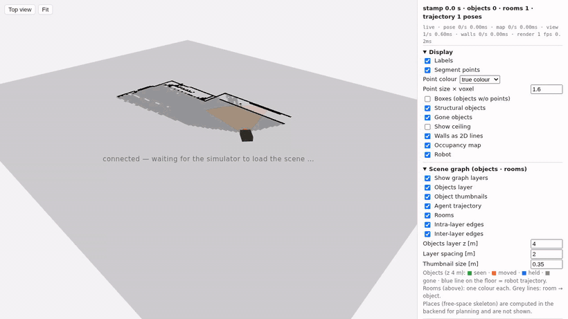
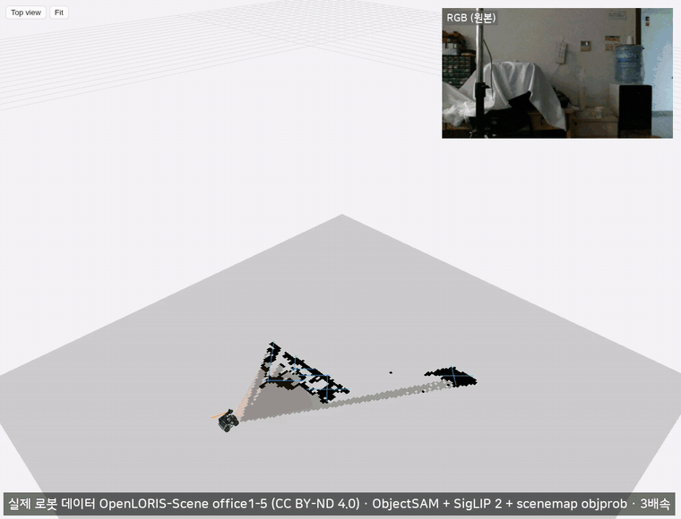
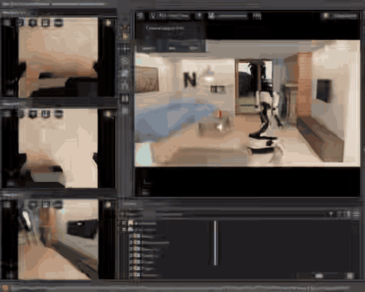
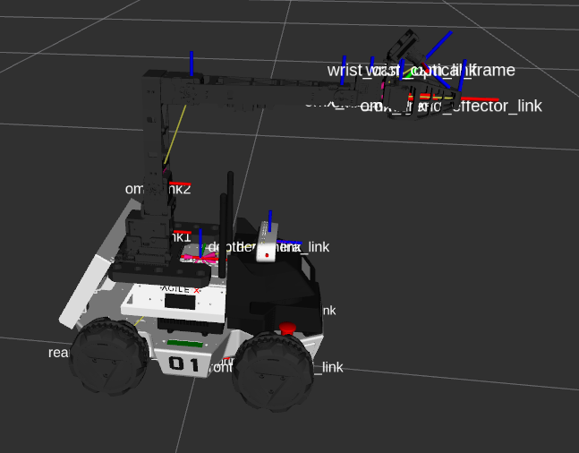
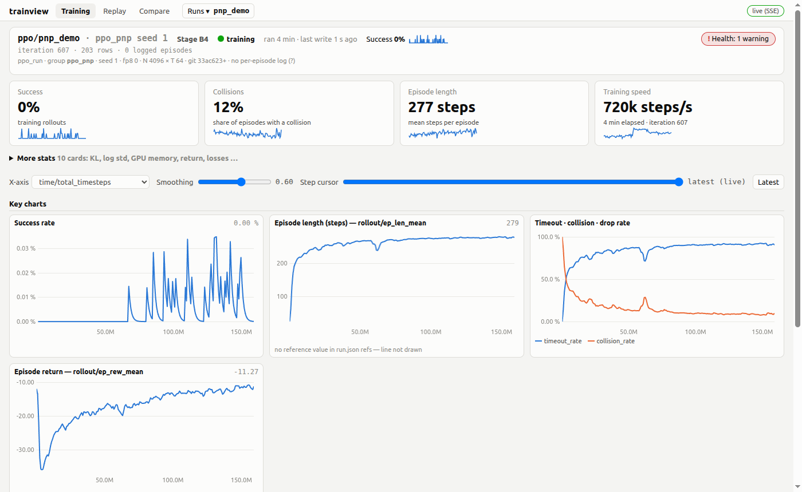
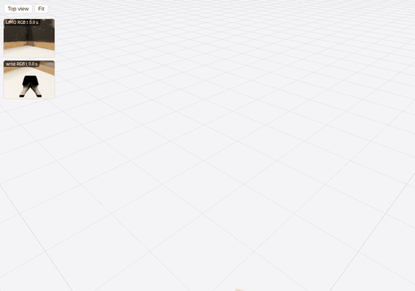
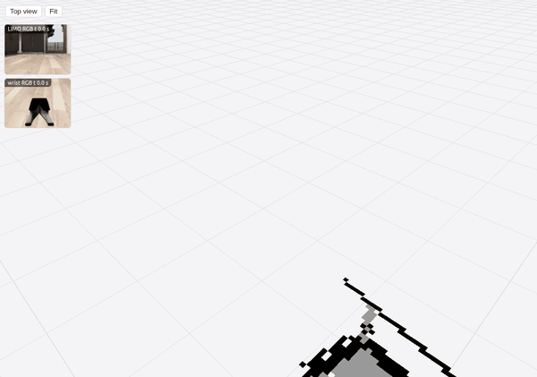
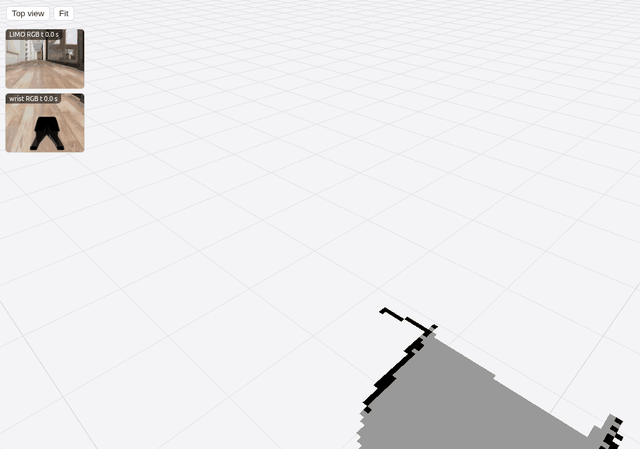
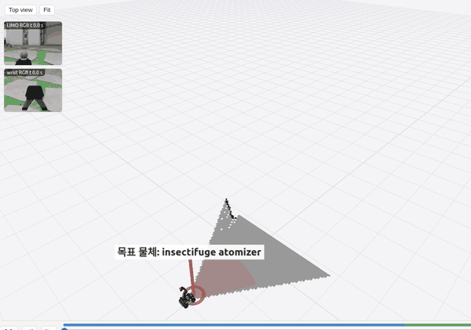

<div align="center">

<h2>
  <picture>
    <source media="(prefers-color-scheme: dark)" srcset="docs/assets/icon-bot-dark.svg">
    
  </picture>
  우리는 물체를 기억하는 로봇을 만든다 - 자유주제
</h2>

<a href="https://plausible-hallway-e4f.notion.site/3eb454b08de28190b2e8e321a33a9371">팀 노션</a> &nbsp;·&nbsp; <a href="docs/plan.md">계획</a> &nbsp;·&nbsp; <a href="docs/model_selection.md">모델 선택</a> &nbsp;·&nbsp; <a href="refs/README.md">참고 자료</a>

<br><br>



<sub>로봇의 물체 기억(MIT Spark-DSG를 수정해 사용) 뷰어 — ObjectSAM 분할 + SigLIP 2 이름·임베딩 + scenemap 확률 모드(objprob)로 2D 지도 위에 물체를 세그먼트 점구름으로 등록하고, 누르면 위치·상태와 그 물체를 본 순간의 RGB·깊이 조각을 보여 준다 (BEHAVIOR 시뮬레이션, 3배속)</sub>

<br><br>



<sub>실제 로봇 데이터(OpenLORIS-Scene, CC BY-ND 4.0)에 우리 인지 파이프라인(ObjectSAM 분할 + SigLIP 2 이름·임베딩 + scenemap 확률 모드(objprob) + scenemap SLAM·물체 기억·장면 그래프)을 돌린 모습, 3배속 — office1-5, 바퀴 오도메트리 + 깊이 스캔 맞추기. 오른쪽 위 작은 창은 bag 의 RGB 원본 프레임(크기만 줄이고 고치지 않음). 데이터: X. Shi et al., "Are We Ready for Service Robots? The OpenLORIS-Scene Datasets for Lifelong SLAM", ICRA 2020 (<a href="https://lifelong-robotic-vision.github.io/dataset/scene">OpenLORIS-Scene</a>, iVip Tsinghua · Intel). <a href="docs/assets/realbag_openloris_office.mp4">MP4</a> · 잰 값은 <a href="docs/map_vla/MAP_STATE_PLAN.md">MAP_STATE_PLAN</a> "실제 데이터"</sub>

<br><br>

<table>
<tr>
<td align="center" width="50%"></td>
<td align="center" width="50%"></td>
</tr>
<tr>
<td align="center"><sub>BEHAVIOR-1K 장면(OmniGibson)에서 로봇이 라디오를 집어 켜는 모습 (turning_on_radio, 6배속)</sub></td>
<td align="center"><sub>리모 + 매니퓰레이터 URDF 를 RViz 에 띄운 모습 (TF 프레임 표시)</sub></td>
</tr>
</table>
<br><br>



<sub>학습 뷰어(<a href="training/viewer">trainview</a>, Rust 서버 + 브라우저) 학습 탭 — GPU 안에서 도는 RL 교사 학습을 실시간으로(성공률·판 길이·시간 초과·충돌·보상)</sub>

<br><br>



<sub>학습 뷰어의 리플레이 탭 — 커리큘럼 1단계 <b>지도 최대한 많이 쌓기</b>. RL 교사가 받는 목표는 없고, 보상 = 새로 덮은 방 칸(60 초 안 방 칸 60 % 덮으면 성공 — 이 판 성공). 교사(house_single_floor, 빈 지도에서 자라는 지도, 30 분 학습)의 판을 OmniGibson 에서 다시 돌려 실제 인지(ObjectSAM + SigLIP 2 + scenemap, 점구름)로 본 모습. 왼쪽 위 = 몸통 카메라·손목 카메라, 1배속</sub>

<br><br>



<sub>커리큘럼 2단계 <b>목표 지점 주면 가기</b>. RL 교사가 받는 목표 = 지도 위 한 점(초록 기둥 "목표 지점", 앱에서 사용자가 누르는 바닥 지점), 그 점 0.3 m 안에 서면 성공(이 판 7.6 m, 18 초). 교사(house_single_floor, 빈 지도에서 자라는 지도, 20 분 학습·성공률 75 %)의 판을 OmniGibson 에서 다시 돌려 실제 인지(ObjectSAM + SigLIP 2 + scenemap, 점구름)로 본 모습. 왼쪽 위 = 몸통 카메라·손목 카메라, 1배속</sub>

<br><br>



<sub>커리큘럼 3단계 <b>물체 찾기</b>. 교사가 받는 목표 = 물체 종류(빨간 기둥 "목표 물체: pen" — 정답 위치를 덧그린 것, 교사는 모름). 빈 지도에서 돌아다니며 펜을 지도에 확정하고 카메라에 넣으면 성공(19 초). 같은 방식, 1배속.</sub>

<br><br>



<sub>커리큘럼 4단계 <b>물체 잡기</b>. 목표 = 물체(빨간 기둥 "목표 물체: insectifuge atomizer"), 물체 앞에서 시작해 팔을 뻗어 집어 들면 성공(15 초). <b>이 판은 RL 교사가 아니다</b>: 처음부터 PPO 는 잡기 성공 0 이라, 대본 특권 교사(정답 상태로 움직이는 규칙 코드, 98 %) 시연을 BC 학생(MLP 222 만 변수, 빈 지도)이 따라한 판(학습 집 성공 10 %). 집은 house_double_floor_lower(house_single_floor 에는 찾아 잡을 수 있는 물체가 7 개뿐). 같은 방식, 1배속. 단계 정의(1 지도 쌓기 → 2 지점 가기 → 3 물체 찾기 → 4 잡기 → 5 찾아서 잡기)는 <a href="training/curriculum/README.md">커리큘럼</a></sub>

</div>

<br>

로봇이 집 안을 돌아다니며 본 물체를 기억해 둔다. 그래서 사람이 물체를 찾거나 옮겨 달라고 하면, 어디 있는지 다시 뒤지지 않고 기억을 떠올려 바로 움직인다.

## 이런 걸 할 수 있어요

| 사람이 말하면 | 로봇은 |
|---|---|
| "컵 어디 있었지?" | 기억에서 찾아 "주방 식탁 위에 있었어요" 라고 답한다 |
| "컵을 식탁에 갖다 놔" | 컵 위치로 이동 → 집기 → 식탁으로 이동 → 놓기 |
| (누가 컵을 옮겨 놓으면) | 다음에 봤을 때 기억을 새 위치로 고친다 |
| (중간에 집기를 실패하면) | 다시 확인하고 재시도한다 |

## 어떻게 동작하나요

```
카메라·라이다 ──▶ ① 물체 기억 ──▶ ② 에이전트 (LLM) ──▶ ③ RecallVLA ──▶ 리모 + 팔
                "무엇이 어디에 있나"   "무엇을 할까"        "지금 어떻게 움직일까"
                       ▲                                              │
                       └────────── 움직이며 본 것으로 기억 갱신 ◀───────┘
```

1. **물체 기억** — 로봇이 본 물체를 2D 지도 위에 등록하고, 옮겨지거나 사라지면 고친다. 물체는 ObjectSAM 으로 자르고 SigLIP 2 로 이름·임베딩을 붙이며, 같은 물체는 확률로 합친다(scenemap). 위치는 Cartographer SLAM.
2. **에이전트 (LLM)** — 사람과 채팅으로 대화하고, 물체 기억에서 찾아(이름·생김새) 무엇을 집어 어디에 놓을지 정한다. Qwen3.5-9B.
3. **RecallVLA** — 카메라 영상과 물체 기억을 **기억 인코더**(물체 인코더 → 기억 요약 인코더 → 기억 토큰)에 넣고, 그 토큰과 카메라를 보고 로봇 팔·바퀴를 움직인다. 정답 지도 없이, 빈 지도에서 frontier 탐사와 SLAM 으로 지도가 자라는 그 상황 안에서 과제(지도 쌓기 → 목표 지점 가기 → 물체 찾기 → 잡기 → 찾아서 잡기)를 해내도록 학습한다. 학습은 **교사·학생** 두 단계다: 시뮬 상태를 아는 **RL 정책이 교사**로 과제를 먼저 익히고, **RecallVLA 는 학생**으로 그 교사의 시연을 **모방학습**(BC·DAgger)해 카메라와 물체 기억만으로 따라 한다. Qwen3.5-0.8B + SigLIP 2 → 다음 단계 문장 + 행동([사양](docs/map_vla/MAPVLA_SPEC.md), [커리큘럼](training/curriculum/README.md)).

## 로봇

AgileX 리모(LIMO, 기본형 가정 — 프로일 수도 있음) + ROBOTIS OMX-F 팔. 로봇 설명(URDF)은 [`src/robot`](src/robot/README.md), 전제와 할 일은 [계획](docs/plan.md).

## 폴더 구조

```
robot-agent/
├── src/
│   ├── scene_graph/ # ① 물체 기억 — scenemap(지도·물체)·clip(SigLIP 2)·ovdet(분할)·runtime·sgview(뷰어)·tools/realbag(실제 bag 평가)
│   ├── agent/       # ② 에이전트 — runtime(도구 호출 루프)·tools(코드)·skills(지시문)·planner·prompts
│   ├── vla/         # ③ RecallVLA 실행 쪽(학습은 training/)
│   ├── robot/       # 리모 + OMX-F 로봇 설명(URDF·RViz·OmniGibson 설정)
│   ├── sim/         # 시뮬 실행(OmniGibson 리모 탐사·지도·move_robot)
│   └── app/         # 휴대폰 앱(iOS·Android)
├── training/        # 학습 — RL(교사·GPU 환경)·BC(학생)·vla(RecallVLA)·fastsam(ObjectSAM)·viewer(학습 뷰어)·embed
├── config/          # 경로 설정(paths.env)
├── tools/           # 빌드·실행·점검(build_all.sh, check_env.sh, run_sgview.sh …)
├── docs/            # 계획·모델 선택·설계 문서(목록은 docs/README.md)
├── refs/          # 참고 논문·코드·데이터시트 목록(받기: refs/download.sh)
└── build/ · models/ · data/ · third_party/   # git 밖 — 빌드 결과·가중치·데이터·외부 코드(BEHAVIOR-1K, Cartographer)
```

자세한 배치: [docs/LAYOUT.md](docs/LAYOUT.md)

## 문서

| 문서 | 내용 |
|---|---|
| [계획](docs/plan.md) | 무엇을 만드나, 할 일과 상태, 위험 |
| [모델 선택](docs/model_selection.md) | 부품마다 무엇을 쓰고 왜 |
| [map_vla](docs/map_vla/README.md) | RecallVLA·관측·학습 설계 |
| [src/scene_graph](src/scene_graph/README.md) | 물체 기억 코드·빌드 |
| [training](training/README.md) | 학습(교사·학생·RecallVLA·ObjectSAM·학습 뷰어) |
| [docs/README.md](docs/README.md) | 전체 문서 목록 |

## 시작하기

```bash
git clone https://github.com/juyoung020/robot-agent.git
cd robot-agent
tools/check_env.sh              # 필요한 외부 경로·도구 점검 (경로는 config/paths.env, 내 PC 값은 config/paths.local.env)
tools/build_all.sh              # 전부 build/ 에 빌드. 골라서: tools/build_all.sh sgrt sgview
tools/run_sgview.sh <기억 폴더> [--live]   # 물체 기억 뷰어
bash refs/download.sh           # 참고 논문·코드 받기(선택)
```

시뮬은 BEHAVIOR-1K 장면(OmniGibson)을 쓴다. `third_party/BEHAVIOR-1K` 에 받고 데이터 약관에 동의해야 한다.

## 라이선스

우리 코드는 [Apache-2.0](LICENSE) 이다. 제3자 구성 요소는 각자 라이선스를 따른다.
- Qwen3.5(0.8B 가중치) — Apache-2.0
- SigLIP 2(open_clip / timm 가중치) — Apache-2.0
- PE-Core(지금 이름표에 쓰는 글 공간) — Apache-2.0
- Cartographer — Apache-2.0
- ObjectSAM 가중치 — AGPL-3.0 ([github.com/juyoung020/ObjectSAM](https://github.com/juyoung020/ObjectSAM))
- BEHAVIOR-1K / OmniGibson 코드 — MIT, **BEHAVIOR 데이터(장면·물체 자산)는 자체 약관**(비상업 학술 연구만, 재배포 금지). 이 저장소는 BEHAVIOR 자산을 담지 않는다.
- spark_dsg — MIT 저작권 문구(`src/scene_graph/spark_dsg/LICENSE`)

RecallVLA 를 BEHAVIOR 자산으로 학습한 가중치는 비상업 연구용으로 공개한다.
