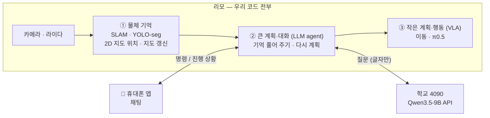

# 계획

**물체를 기억하는 로봇**을 만들기 위해 무엇을, 어디서, 어떤 순서로 할지 정리한 문서.
부품을 왜 그렇게 골랐는지는 [모델 선택](model_selection.md), 참고 논문·코드는 [참고 자료](../refs/README.md).

## 무엇을 만드나

사람이 휴대폰 채팅으로 로봇에게 말하면, 로봇이 **기억해 둔 물체 지도**를 보고 스스로 계획을 세워 움직인다.

> 나: "컵 식탁에 갖다 놔"
> 로봇1: "컵 위치로 이동 중이에요" → "컵을 집었어요" → "컵을 식탁에 놨어요 ✅"

## 전체 구조

| 어디서 | 무엇을 |
|---|---|
| **리모** | 우리가 짠 코드 전부 — SLAM, 물체 인식, 물체 기억, agent, 이동, π0.5 |
| **학교 4090** | Qwen3.5-9B API (agent 가 호출) 와 π0.5 학습만. 로봇 코드는 돌리지 않음 |
| **휴대폰** | 채팅 앱 — 로봇에게 명령하고 진행 상황을 받음 |
| **시뮬레이션** | 2025 BEHAVIOR Challenge 벤치마크 — 실제 로봇 전에 개발·평가 |

## 준비물

| 항목 | 내용 |
|---|---|
| 로봇 | AgileX 리모 **기본형 (가정)** — Jetson Nano 4GB, 라이다 EAI X2L, RGB-D 카메라 Orbbec DaBai, Ubuntu 18.04 |
| 로봇 (받을 수도 있음) | AgileX 리모 **프로** — Jetson Orin Nano 8GB, 라이다 EAI T-mini Pro, RGB-D 카메라 Orbbec DaBai, ROS 1 Noetic · ROS 2 Foxy 공식 지원. 받으면 이 문서의 "기본형" 가정을 프로로 바꾼다 |
| 로봇 팔 | 매니퓰레이터를 달 예정 — **모델 미정** |
| NPU | **DEEPX DX-M1 (보유)** — 25 TOPS (INT8), 메모리 4GB, M.2. π0.5 가 리모에서 안 돌면 라즈베리파이 5 에 달아서 리모에 추가 |
| 서버 | 학교 컴퓨터 RTX 4090 (24GB) |

## 코드 규칙

**우리가 작성하는 코드는 모두 C++ · CUDA · Rust 로 한다.**

| 언어 | 쓰는 곳 |
|---|---|
| C++ | ROS 2 노드, 3D 위치 계산, 물체 기억(DA·지도 갱신), 모델 실행 (TensorRT) |
| CUDA | GPU 로 빨라야 하는 부분 — depth → 점구름, 마스크 처리, π0.5 실행 |
| Rust | 통신과 실행 흐름 — 앱 ↔ 리모, agent (Qwen API 호출) |

예외: 휴대폰 앱은 Swift(iOS)·Kotlin(Android), 모델 **학습**은 원래 도구(Python), 가져다 쓰는 외부 도구는 원래 언어 그대로 (가능하면 C++ 쪽을 고른다).

---

## 할 일

담당 칸은 역할이 정해지면 채운다.

### 1. 로봇 기본 — 다른 파트가 모두 여기에 기대므로 가장 먼저

| 할 일 | 내용 | 담당 |
|---|---|---|
| ROS 2 올리기 | 리모 기본형은 ROS 1. **이미 ROS 2 로 포팅된 것을 찾아 쓴다** (후보: [참고 자료](../refs/README.md#리모-ros-2-포팅된-것-찾기) — 공식 `limo_ros2` foxy 브랜치, Docker 판 등) | |
| 지도 만들기 (SLAM) | 2D 라이다 SLAM (Cartographer) 으로 방 지도를 한 번 만들고, 평소엔 그 위에서 위치만 추정 | |
| 이동 | 저장한 지도 위에서 목표 위치까지 가기 (내비게이션) | |
| 캘리브레이션 | 카메라 내부 값, 카메라가 로봇 어디에 달렸는지 — 물체 3D 위치 계산에 필요. 팔이 정해지면 팔-카메라 관계도 | |
| 좌표 연결 (tf) | `map → base_link → camera` 좌표가 이어지는지, depth 가 컬러 영상과 맞는지 확인 | |
| 팔 움직이기 | 매니퓰레이터가 정해지면 ROS 2 로 집기·놓기 | |
| 녹화 | 카메라·위치·관절을 ros2 bag 으로 녹화해 두고 다른 파트가 로봇 없이 실험. 스크립트는 `scripts/` | |
| 토픽·사양 정리 | 토픽 이름·메시지 타입·주기, 센서 사양 → `docs/` | |

### 2. 물체 기억 (scene graph) — `src/scene_graph/`

| 할 일 | 내용 | 담당 |
|---|---|---|
| 물체 인식 | YOLO-seg (가장 작은 nano 모델) 를 TensorRT FP16 으로 바꿔 리모에서 실행 → 물체의 영역과 이름 | |
| 지도 위치 | 영역 안 픽셀 + depth → 2D 지도 좌표(x, y). 가장자리를 살짝 빼고 **중앙값**으로 물체 위치 하나 | |
| 같은 물체 판단 (DA) | 새로 본 물체가 이미 아는 물체인지 — **직접 만든다**. 같은 이름끼리 위치로 비교 | |
| 지도 갱신 | 옮겨짐·사라짐·생김을 찾아 바뀐 부분만 고친다 — **직접 만든다** | |
| 저장·보기 | Spark-DSG 로 저장, `spark-dsg visualize` 로 확인. agent 에게는 JSON 으로 | |

### 3. 큰 계획·대화 (LLM agent) — `src/agent/`

| 할 일 | 내용 | 담당 |
|---|---|---|
| Qwen 서버 | 학교 4090 에 Qwen3.5-9B API 띄우기 | |
| 상황 풀어 주기 | 물체 지도를 보고 π0.5 에게 줄 지시를 만든다 ("컵은 주방 식탁 위, 놓을 곳은 거실 식탁") | |
| 다시 계획 | 물체가 화면 밖으로 벗어나 π0.5 가 움직일 수 없으면, 기억을 보고 물체가 보이는 곳으로 이동시킨 뒤 다시 지시 | |
| 질문에 답하기 | "컵 어디 있었지?" → 지도에서 찾아 답 | |
| 평가 | 명령 10~20개로 성공률·응답 시간 | |

### 4. 작은 계획·행동 (VLA, π0.5) — `src/vla/`

| 할 일 | 내용 | 담당 |
|---|---|---|
| 시뮬레이션 학습 | BEHAVIOR 대회 데이터(축소판 약 260GB) 와 공개된 1·2위 모델에서 시작해 4090 에서 LoRA 학습 | |
| 실제 로봇 학습 | 리모로 직접 모은 시연 데이터로 따로 학습 (대회 로봇과 몸이 달라서) | |
| 리모에서 실행 | 양자화 + C++/CUDA 로 리모(Jetson Nano) 에서 돌리기 | |
| 안 되면 | 라즈베리파이 5 + DEEPX DX-M1 NPU 로 포팅 (DXNN SDK) | |
| 지시 형식 | agent 가 주는 지시와 형식 맞추기 | |
| 실패 복구 | 집다가 놓치는 것처럼 눈앞에서 생긴 실패는 π0.5 가 스스로 다시 시도 | |

### 5. 앱 — `src/app/`

카카오톡처럼 채팅 목록에 로봇이 친구처럼 보이고, 채팅방에서 말로 명령한다. **지금은 로봇1 만** 있고, 로봇2·로봇3 을 나중에 붙일 수 있게만 만들어 둔다.

| 할 일 | 내용 | 담당 |
|---|---|---|
| iOS 앱 | Swift / SwiftUI | |
| Android 앱 | Kotlin / Jetpack Compose | |
| 채팅 목록·채팅방 | 명령 보내기, 단계별 진행 상황과 성공·실패 받기 | |
| 로봇 연결 | 앱 ↔ 리모 실시간 연결 (WebSocket), 학교 밖 접속 방법 | |

### 6. 합치기와 평가

| 할 일 | 내용 | 담당 |
|---|---|---|
| 시뮬레이션에서 | BEHAVIOR 에서 물체 기억 → 계획 → 행동 전체 흐름. 정답 위치를 주므로 SLAM 없이 먼저 해 볼 수 있다 | |
| 실제 리모에서 | 같은 흐름을 리모에서, 앱으로 명령 | |
| 점수 | BEHAVIOR 점수를 대회 상위 팀과 비교, 지도 갱신은 변화 탐지 정확도로 | |

---

## 아직 모르는 것 · 위험

| 무엇 | 왜 문제인가 | 어떻게 |
|---|---|---|
| **π0.5 가 리모에서 돌까** | 공식 기준 실행에 8GB 이상, 리모는 4GB 를 다른 것과 나눠 씀 | 먼저 재 보고, 안 되면 라즈베리파이 5 + DEEPX DX-M1. 더 작은 VLA(SmolVLA) 도 후보. **프로(8GB)면** int8·int4 로 줄여 돌릴 만함 |
| 리모 ROS 2 | 기본형은 Ubuntu 18.04 라 최신 ROS 2 가 안 깔림 | 포팅된 것 중 우리 리모에서 되는 것 찾기. **프로면** ROS 2 Foxy 공식 지원이라 거의 해결 |
| 매니퓰레이터 | 모델이 안 정해져서 팔 제어·캘리브레이션을 못 정함 | 정해지면 로봇 파트에 추가 |
| 리모 메모리 4GB | SLAM·YOLO-seg·물체 기억·π0.5 가 모두 한 곳에 | 가벼운 모델 우선, 입력 해상도 줄이기. 프로는 8GB |
| 기본형? 프로? | 받는 로봇에 따라 ROS 버전, CUDA·TensorRT 버전, 라이다 설정이 달라짐 | 정해지기 전에는 두 쪽 다 되게 짜고, 정해지면 이 문서를 고친다 |
| 학교 밖 접속 | 앱과 Qwen API 를 밖에서 쓰려면 네트워크를 열어야 함 | VPN 등, 학교 규칙 확인 |
| 4090 하나 | π0.5 학습(22.5GB 이상) 중엔 Qwen·시뮬레이터를 못 씀 | 학습과 사용 시간을 나눈다 |

---

변경 기록

| 날짜 | 바뀐 것 | 이유 |
|---|---|---|
| 2026-09-30 | 계획 처음 작성 (scene graph·로봇·VLA·agent·통합) | |
| 2026-09-30 | 전제 추가: 기본 리모(AgileX LIMO)로 가정, 매니퓰레이터는 모델 미정 | 로봇 사양이 아직 확정 안 됨 |
| 2026-09-30 | 전제 추가: 학교 RTX 4090 (24GB) 서버 사용 가능 | 리모(Jetson Nano 4GB)에서는 π0.5 를 못 돌림 → 학습·추론은 서버에서 |
| 2026-09-30 | 물체 인식: SAM + CLIP → **YOLO-seg** 하나로 | 영역과 이름을 한 번에 줘서 더 빠르고 가벼움. 80종 밖의 물건이 필요하면 YOLOE / YOLO-World |
| 2026-09-30 | DA: **자체 제작**, 같은 이름끼리 위치로 비교 | CLIP 특징을 안 쓰므로. 같은 종류가 여러 개일 때가 약점 |
| 2026-09-30 | 맵 업데이트: **자체 제작** | |
| 2026-09-30 | Scene graph 저장·보기: **Spark-DSG + 뷰어** | Hydra·Khronos 와 같은 형식 |
| 2026-09-30 | π0.5 실행: 기본은 4090 원격 추론, **필요하면** 라즈베리파이 5 → NPU 포팅 | 로봇 위에서 직접 돌려야 할 때를 대비 |
| 2026-09-30 | SLAM: **2D 라이다 SLAM (Cartographer)**, 3D SLAM 안 씀 | Jetson Nano 에 3D SLAM 은 무거움. 물체 위치는 pose + depth 로 충분 |
| 2026-10-02 | 목표: 3D 씬그래프 → **2D 씬그래프** — 물체를 2D 지도 위(x, y)에 등록 | |
| 2026-09-30 | 시뮬레이션: **2025 BEHAVIOR Challenge 벤치마크** | 대회 상위 팀과 점수 비교 가능 |
| 2026-09-30 | Agent LLM: **Qwen3.5-9B**, 학교 4090 에서 API 로 | 요금·외부 인터넷 불필요 |
| 2026-09-30 | **SLAM·YOLO-seg 는 리모에서 실행** (YOLO-seg 는 TensorRT FP16, C++) | 리모 Jetson Nano 에서 돌아가는 가벼운 모델 |
| 2026-09-30 | 리모 ROS 1 → ROS 2: 직접 연결(ros1_bridge) 대신 **이미 포팅된 것 찾기** | |
| 2026-09-30 | **우리 코드는 전부 리모에서 실행.** π0.5 도 웬만하면 리모, 안 되면 라즈베리파이 5 + NPU. 4090 은 Qwen API·학습만 | 로봇이 서버 없이 스스로 움직이게 |
| 2026-09-30 | 코드 원칙: **모든 코드는 C++ · CUDA · Rust** (앱·학습·외부 도구는 예외) | |
| 2026-09-30 | 앱 추가: iOS·Android 네이티브, 카카오톡식 채팅으로 명령, **로봇1 만** | 사람이 말로 로봇을 부리는 창구 |
| 2026-09-30 | NPU: AI HAT+ 2 → **DEEPX DX-M1 (이미 보유)** | 가지고 있는 NPU 사용 |
| 2026-09-30 | 문서 정리: 사용자 관점으로 다시 씀 (무엇을 만드나·전체 구조·파트별 할 일·위험) | 읽기 쉽게 |
| 2026-10-02 | 전제 추가: 리모 **프로** (Jetson Orin Nano 8GB, ROS 2 Foxy 공식 지원) 를 받을 수도 있음 | 받으면 ROS 2 포팅·메모리 위험이 크게 줄어듦 |

