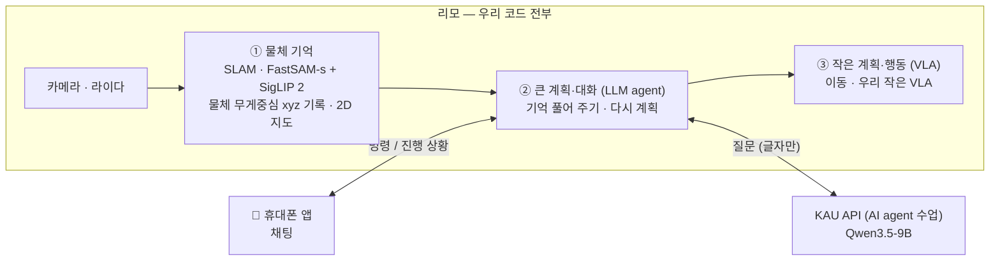

# 계획

**물체를 기억하는 로봇**을 만들기 위해 무엇을, 어디서, 어떤 순서로 할지 정리한 문서.
부품을 왜 그렇게 골랐는지는 [모델 선택](model_selection.md), 참고 논문·코드는 [참고 자료](../refs/README.md).

## 무엇을 만드나

사람이 휴대폰 채팅으로 로봇에게 말하면, 로봇이 **기억해 둔 물체 지도**를 보고 스스로 계획을 세워 움직인다.

> 나: "컵 식탁에 갖다 놔"
> 로봇1: "컵 위치로 이동 중이에요" → "컵을 집었어요" → "컵을 식탁에 놨어요 ✅"

## 전체 구조

| 어디서 | 무엇을 |
|---|---|
| **리모** | 우리가 짠 코드 전부 — SLAM, 물체 인식, 물체 기억, agent, 이동, VLA |
| **KAU API** | Qwen3.5-9B (AI agent 수업 제공, agent 가 호출) |
| **학교 4090** | π0.5 학습(LoRA)만 하려던 자리. π0.5 를 버려서(10-04) 무엇에 쓸지는 아직 안 정함. 로봇 코드는 돌리지 않음 |
| **시뮬 작업 PC** | `jy-desktop` (RTX 5070 Ti 16GB) — 시뮬 평가, 우리 VLA 학습(RL 교사·BC 학생, `training/`), 물체 기억 시험 |
| **휴대폰** | 채팅 앱 — 로봇에게 명령하고 진행 상황을 받음 |
| **시뮬레이션** | 2026 BEHAVIOR Challenge 벤치마크 — 실제 로봇 전에 개발·평가 (참고 코드는 2025 상위 팀 것) |

## 준비물

| 항목 | 내용 |
|---|---|
| 로봇 | AgileX 리모 **기본형 (가정)** — Jetson Nano 4GB, 라이다 EAI X2L, RGB-D 카메라 Orbbec DaBai, Ubuntu 18.04 |
| 로봇 (받을 수도 있음) | AgileX 리모 **프로** — Jetson Orin Nano 8GB, 라이다 EAI T-mini Pro, RGB-D 카메라 Orbbec DaBai, ROS 1 Noetic · ROS 2 Foxy 공식 지원. 받으면 이 문서의 "기본형" 가정을 프로로 바꾼다 |
| 로봇 팔 | 매니퓰레이터 **ROBOTIS OMX-F** (URDF `src/robot/map_vla_description`) |
| NPU | **DEEPX DX-M1 (보유)** — 25 TOPS (INT8), 메모리 4GB, M.2. VLA 가 리모에서 안 돌면 라즈베리파이 5 에 달아서 리모에 추가 |
| 서버 | 학교 컴퓨터 RTX 4090 (24GB) — π0.5 LoRA 학습용이었음(π0.5 버림, 10-04) |
| LLM | AI agent 수업(최영식 교수님)이 주는 Qwen API — `https://agent.kau.ac.kr/v1`, 모델 `qwen3.5-9b` (vLLM) |
| 시뮬 작업 PC | `jy-desktop` — Ubuntu 22.04, RTX 5070 Ti 16 GB, CUDA 12.8 (서브모듈 `docs/Linux_설치.md`) |

## 코드 규칙

**우리가 작성하는 코드는 모두 C++ · CUDA · Rust 로 한다.**

| 언어 | 쓰는 곳 |
|---|---|
| C++ | ROS 2 노드, 3D 위치 계산, 물체 기억(DA·지도 갱신), 모델 실행 (TensorRT) |
| CUDA | GPU 로 빨라야 하는 부분 — depth → 점구름, 마스크 처리, VLA 학습·실행 |
| Rust | 통신과 실행 흐름 — 앱 ↔ 리모, agent (Qwen API 호출) |

예외: 휴대폰 앱은 Swift(iOS)·Kotlin(Android), 모델 **학습**은 원래 도구(Python), 가져다 쓰는 외부 도구는 원래 언어 그대로 (가능하면 C++ 쪽을 고른다).

**시뮬은 실제 로봇과 같은 방식으로 돈다.** 시뮬에서 시험한 코드가 그대로 실제 리모에서 돌아야 하므로, 로봇이 아는 것·판단하는 방법을 실제와 같게 둔다.

- 로봇 위치는 바퀴 오도메트리 + SLAM(`SGRT_POSE=slam`, 기본). 실제 로봇에는 정답 위치가 없다.
- 이동 명령의 도착·결과 판정도 실제와 같은 값(오도메트리)으로 한다. 예: `move_robot` 의 base delta 는 시뮬에서도 바퀴 속도 적분으로 판정한다.
- 시뮬 정답 자세(`SGRT_POSE=gt`)는 **확인용**이다. 지도·탐사만 따로 떼어 볼 때만 쓰고, 성능·점수는 `slam` 판에서 잰다. 정답 자세 때문에 실제 로봇 코드 경로를 바꾸지 않는다.

---

## 할 일

담당 칸은 역할이 정해지면 채운다.

### 1. 로봇 기본 — 다른 파트가 모두 여기에 기대므로 가장 먼저

| 할 일 | 내용 | 담당 |
|---|---|---|
| ROS 2 올리기 | 리모 기본형은 ROS 1. **이미 ROS 2 로 포팅된 것을 찾아 쓴다** (후보: [참고 자료](../refs/README.md#리모-ros-2-포팅된-것-찾기) — 공식 `limo_ros2` foxy 브랜치, Docker 판 등) | |
| 지도 만들기 (SLAM) | 2D 라이다 SLAM (Cartographer) 으로 방 지도를 한 번 만들고, 평소엔 그 위에서 위치만 추정 | |
| 이동 | 저장한 지도 위에서 목표 위치까지 가기 (내비게이션) | |
| 로봇 모델 (URDF) | **리모 URDF**(공식 `limo_ros2` 의 description 패키지)와 **매니퓰레이터 URDF**(팔 제조사 제공)를 구해 하나로 합친다 — 팔 장착 위치, 카메라·라이다 위치 포함. 실제 로봇(TF·RViz)과 시뮬(OmniGibson) 이 같은 URDF 를 쓴다 | |
| 캘리브레이션 | 카메라 내부 값, 카메라가 로봇 어디에 달렸는지 — 물체 3D 위치 계산에 필요. 팔이 정해지면 팔-카메라 관계도 | |
| TF 트리 작성 | 합친 URDF 로 TF 트리를 만든다: `map → odom → base_link → laser_link`, `base_link → camera_link → camera_color_optical_frame`·`camera_depth_optical_frame`, `base_link → arm_base_link → … → gripper_link`. `map → odom` 은 SLAM, `odom → base_link` 는 바퀴 오도메트리, 나머지는 `robot_state_publisher`(URDF + 관절 상태). 캘리브레이션 값을 트리에 넣고, 트리 그림(`view_frames`)을 `docs/` 에 남긴다 | |
| 좌표 연결 확인 | `map → base_link → camera` 좌표가 이어지는지, depth 가 컬러 영상과 맞는지 확인 | |
| 팔 움직이기 | 매니퓰레이터가 정해지면 ROS 2 로 집기·놓기 | |
| 녹화 | 카메라·위치·관절을 ros2 bag 으로 녹화해 두고 다른 파트가 로봇 없이 실험. 스크립트는 `scripts/` | |
| 토픽·사양 정리 | 토픽 이름·메시지 타입·주기, 센서 사양 → `docs/` | |

### 2. 물체 기억 (scene graph) — `src/scene_graph/`

| 할 일 | 내용 | 담당 |
|---|---|---|
| 물체 인식 | 임베딩 벡터 찾기를 택해서 다시 **SAM + CLIP 구조**: **FastSAM-s(입력 416)** 로 물체 영역 → **SigLIP 2 B/32** 영상 임베딩(찾기용 벡터 + 이름 찾기) (서브모듈 `src/behavior-2026/src/scene_graph/clip`, 작업 중). 그 전 계획은 YOLO-seg nano 를 TensorRT FP16 으로 리모에서 실행, 시뮬에서 지금 돌아가는 건 YOLOE(`ovdet`) | |
| 물체 위치 (xyz) | 분할 모델이 물체 영역(마스크)과 그 **무게중심**을 찾아 준다 → 무게중심 + depth → 월드 좌표 **xyz** 로 기록. 물체마다 위치 하나 | |
| 같은 물체 판단 (DA) | 새로 본 물체가 이미 아는 물체인지 — **직접 만든다**. 같은 이름끼리 위치로 비교. 같은 이름이 여럿이면 임베딩 유사도를 붙이는 것이 후보 | |
| 물체 찾기 | **임베딩 벡터 찾기**(질의 글 벡터 ↔ 물체 벡터, 코사인 유사도) + **이름(의미) 찾기**(라벨 표 이름·상위어) 둘 다. 찾은 결과를 LLM 에 넣어 답하는 RAG 구조 — [모델 선택](model_selection.md) | |
| 지도 갱신 | 옮겨짐·사라짐·생김을 찾아 바뀐 부분만 고친다 — **직접 만든다** | |
| 방 나누기·이름 | 2D 지도를 방으로 나누고(Hydra room finder 의 2D 판, 방 id 유지), 방 안 물체로 방 종류를 붙인다. **CLIP + SAM 구조로 한다**: (1) 물체 이름은 검출기 클래스가 아니라 **SigLIP 2 이름**(기억 폴더 `cache/names.json`, 라벨 표 + 상위어)을 방 이름 규칙(냉장고 → kitchen 등)에 넣는다 — FastSAM-s 는 이름이 `object` 하나라 이게 없으면 모든 방이 "room N" 이 된다. (2) 다음 단계로 **임베딩 제로샷 분류**: "a kitchen"·"a bedroom" 같은 글 벡터를 방 안 물체 벡터·방에서 찍은 장면과 코사인으로 비교해 방 종류를 고른다 → 규칙표에 없는 방(세탁실·차고)·물체가 적은 방도. LLM 이 정한 이름은 `sm_set_room_name` 으로 덮어쓴다 — [모델 선택](model_selection.md) | |
| 저장·보기 | Spark-DSG 로 저장, 보기는 **2D 지도**(물체를 지도 위에 표시). 물체 벡터는 원본 임베딩 그대로, 이름은 기억 폴더의 `cache/`. 지도 자세는 `SGRT_POSE`(`slam`·`odom`·`gt`). agent 에게는 JSON 으로 | |

### 3. 큰 계획·대화 (LLM agent) — `src/agent/`

| 할 일 | 내용 | 담당 |
|---|---|---|
| Qwen API 연결 | AI agent 수업이 주는 KAU API(`https://agent.kau.ac.kr/v1`, `qwen3.5-9b`)에 붙기. 서버는 우리가 띄우지 않는다 | |
| 상황 풀어 주기 | 물체 지도를 보고 VLA 에게 줄 지시를 만든다 ("컵은 주방 식탁 위, 놓을 곳은 거실 식탁") | |
| 다시 계획 | 물체가 화면 밖으로 벗어나 VLA 가 움직일 수 없으면, 기억을 보고 물체가 보이는 곳으로 이동시킨 뒤 다시 지시 | |
| 질문에 답하기 | "컵 어디 있었지?" → 물체 찾기(임베딩·이름)로 기억에서 찾아, 그 결과를 넣어 답 (RAG) | |
| 평가 | 명령 10~20개로 성공률·응답 시간 | |

### 4. 작은 계획·행동 (VLA) — `src/vla/`

> **10-04 바뀜**: π0.5 는 버렸다(가중치도 지움). VLA 는 **우리 작은 VLA** 다 — 얼린 SigLIP 2 영상 탑 + 지도 토큰 + 지시 문장 → flow matching 행동 전문가, 시뮬 RL 교사에게서 BC·DAgger 로 배운다(`training/BC`, G5 완료, 이 PC 에서 학습). 얼린 Qwen 을 쓰는 큰 판은 G7 계획. 아래 π0.5·LoRA 행은 기록으로 남긴다(대체됨).

| 할 일 | 내용 | 담당 |
|---|---|---|
| 시뮬레이션 학습 (대체됨) | BEHAVIOR 대회 데이터(축소판 약 260GB) 와 공개된 1·2위 모델에서 시작해 학교 4090 에서 LoRA 학습. 평가는 시뮬 작업 PC 에서 | |
| 우리 VLA 설계 | π0.5 입력(영상·관절·글)에 **물체 기억(Spark-DSG) 지도를 토큰으로** 넣은 작은 VLA 를 직접 만든다. 카메라 2장 + 몸 상태 56(관절 각도·속도·xyz, 손끝 방향·속도) + 물체 칸 ≤ 16(로봇·손끝 기준 상대 좌표, 손과의 거리, 이름 뜻·생김새 벡터, 출처·불확실도) + 벽·방 → 행동 8(몸통 2 + 팔 5 + 그리퍼 1). 어떤 집에서도 같은 뜻이 되게(지도 좌표·id·클래스 번호 없음), 이름은 외우지 않게 — [docs/map_vla/VLA_INPUT.md](map_vla/VLA_INPUT.md) | |
| 시뮬에 리모 + 팔 넣기 | 합친 URDF 를 OmniGibson 으로 가져온다: URDF → USD(`import_custom_robot.py`) + RobotDefinition YAML (서브모듈 `docs/raw/site_tutorials_custom_robot_import.md`). 카메라 위치·관절 한계·그리퍼를 실제와 맞추고, 바퀴 2 + 팔 관절 + 그리퍼 제어기를 붙인다 | |
| 시뮬에서 리모용 π0.5 학습 (대체됨 → 우리 VLA 를 `training/` 에서) | 시뮬에서 리모 + 팔로 시연 데이터를 모은다(원격 조종 또는 스크립트로 집기·놓기). 행동·상태 공간은 리모에 맞춰 새로 정하고, 대회 체크포인트에서 시작해 학교 4090 에서 LoRA 학습. 평가는 시뮬 작업 PC 에서 | |
| 실제 로봇 학습 | 시뮬에서 학습한 리모용 VLA(원래 계획은 π0.5)에서 시작해, 리모로 직접 모은 시연 데이터로 이어서 학습 (같은 URDF·TF 라 카메라·좌표가 시뮬과 같다) | |
| 리모에서 실행 | 양자화 + C++/CUDA 로 리모(Jetson Nano) 에서 돌리기 | |
| 안 되면 | 라즈베리파이 5 + DEEPX DX-M1 NPU 로 포팅 (DXNN SDK) | |
| 지시 형식 | agent 가 주는 지시와 형식 맞추기 | |
| 실패 복구 | 집다가 놓치는 것처럼 눈앞에서 생긴 실패는 VLA 가 스스로 다시 시도 | |

### 5. 앱 — `src/app/`

카카오톡처럼 채팅 목록에 로봇이 친구처럼 보이고, 채팅방에서 말로 명령한다. **지금은 로봇1 만** 있고, 로봇2·로봇3 을 나중에 붙일 수 있게만 만들어 둔다.

| 할 일 | 내용 | 담당 |
|---|---|---|
| iOS 앱 | Swift / SwiftUI | |
| Android 앱 | Kotlin / Jetpack Compose | |
| 채팅 목록·채팅방 | 명령 보내기, 단계별 진행 상황과 성공·실패 받기 | |
| 로봇 연결 | 앱 ↔ 리모 실시간 연결 (WebSocket), 학교 밖 접속 방법 | |

### 6. 합치기와 평가

| 할 일 | 내용 | 담당 |
|---|---|---|
| 시뮬레이션에서 | BEHAVIOR 에서 물체 기억 → 계획 → 행동 전체 흐름. 정답 위치(`SGRT_POSE=gt`)로 먼저 흐름을 확인하고, 성능·점수는 실제 로봇과 같은 `slam` 으로 잰다 | |
| 리모 시뮬에서 | 리모 + 팔 모델로 같은 흐름 — 시뮬에서 학습한 리모용 VLA 로 | |
| 실제 리모에서 | 같은 흐름을 리모에서, 앱으로 명령 | |
| 점수 | BEHAVIOR 점수를 대회 상위 팀과 비교, 지도 갱신은 변화 탐지 정확도로 | |

---

## 아직 모르는 것 · 위험

| 무엇 | 왜 문제인가 | 어떻게 |
|---|---|---|
| **VLA 가 리모에서 돌까** | (10-04: π0.5 는 버림, 아래는 π0.5 때 판단) 공식 기준 실행에 8GB 이상, 리모는 4GB 를 다른 것과 나눠 씀. 우리 작은 VLA 는 리모에서 아직 안 재 봄 | 먼저 재 보고, 안 되면 라즈베리파이 5 + DEEPX DX-M1. 더 작은 VLA(SmolVLA) 도 후보. **프로(8GB)면** int8·int4 로 줄여 돌릴 만함 |
| 리모 ROS 2 | 기본형은 Ubuntu 18.04 라 최신 ROS 2 가 안 깔림 | 포팅된 것 중 우리 리모에서 되는 것 찾기. **프로면** ROS 2 Foxy 공식 지원이라 거의 해결 |
| ~~매니퓰레이터~~ (해결: OMX-F) | 모델이 안 정해져서 팔 제어·캘리브레이션을 못 정함. URDF·TF 트리·시뮬 학습도 팔 모델에 달려 있음 | 팔을 빨리 정한다. 그 전에는 리모 URDF 만으로 바퀴·카메라·라이다 TF 와 시뮬 이동부터 |
| 리모 메모리 4GB | SLAM·FastSAM-s·SigLIP 2·물체 기억·VLA 가 모두 한 곳에 | 가벼운 모델 우선, 입력 해상도 줄이기. 프로는 8GB |
| 기본형? 프로? | 받는 로봇에 따라 ROS 버전, CUDA·TensorRT 버전, 라이다 설정이 달라짐 | 정해지기 전에는 두 쪽 다 되게 짜고, 정해지면 이 문서를 고친다 |
| 학교 밖 접속 | 앱과 Qwen API 를 밖에서 쓰려면 네트워크를 열어야 함 | VPN 등, 학교 규칙 확인 |
| ~~LoRA 학습은 학교 4090 에서만~~ (대체됨: π0.5 버림, 우리 VLA 는 이 PC 에서 학습) | 22.5GB 이상이라 시뮬 작업 PC(16GB)에는 안 들어감. 4090 은 한 대 | 학습 시간을 미리 잡고, 평가는 시뮬 작업 PC 에서 따로 |
| 물체 인식 바꾸는 중 | FastSAM-s + SigLIP 2(`clip`)가 아직 작업 중이라 시뮬에서는 YOLOE 가 돈다 | `clip` 이 끝나면 `ovdet` 대신 붙이고 이름 정답률·찾기 R@1 을 다시 잰다 |

---

변경 기록

| 날짜 | 바뀐 것 | 이유 |
|---|---|---|
| 2026-09-30 | 계획 처음 작성 (scene graph·로봇·VLA·agent·통합) | |
| 2026-09-30 | 전제 추가: 기본 리모(AgileX LIMO)로 가정, 매니퓰레이터는 모델 미정 | 로봇 사양이 아직 확정 안 됨 |
| 2026-09-30 | 전제 추가: 학교 RTX 4090 (24GB) 서버 사용 가능 | 리모(Jetson Nano 4GB)에서는 π0.5 를 못 돌림 → 학습·추론은 서버에서 |
| 2026-09-30 | 물체 인식: SAM + CLIP → **YOLO-seg** 하나로 | 영역과 이름을 한 번에 줘서 더 빠르고 가벼움. 80종 밖의 물건이 필요하면 YOLOE / YOLO-World |
| 2026-09-30 | DA: **자체 제작**, 같은 이름끼리 위치로 비교 | CLIP 특징을 안 쓰므로. 같은 종류가 여러 개일 때가 약점 |
| 2026-09-30 | 맵 업데이트: **자체 제작** | |
| 2026-09-30 | Scene graph 저장·보기: **Spark-DSG + 뷰어** | Hydra·Khronos 와 같은 형식 |
| 2026-09-30 | π0.5 실행: 기본은 4090 원격 추론, **필요하면** 라즈베리파이 5 → NPU 포팅 | 로봇 위에서 직접 돌려야 할 때를 대비 |
| 2026-09-30 | SLAM: **2D 라이다 SLAM (Cartographer)**, 3D SLAM 안 씀 | Jetson Nano 에 3D SLAM 은 무거움. 물체 3D 위치는 pose + depth 로 충분 |
| 2026-10-02 | 씬그래프 보기: 3D → **2D 지도**. 물체 위치는 YOLO-seg 마스크의 무게중심 + depth 로 **xyz** 계산해 기록 | |
| 2026-09-30 | 시뮬레이션: **2025 BEHAVIOR Challenge 벤치마크** | 대회 상위 팀과 점수 비교 가능 |
| 2026-09-30 | Agent LLM: **Qwen3.5-9B**, 학교 4090 에서 API 로 | 요금·외부 인터넷 불필요 |
| 2026-09-30 | **SLAM·YOLO-seg 는 리모에서 실행** (YOLO-seg 는 TensorRT FP16, C++) | 리모 Jetson Nano 에서 돌아가는 가벼운 모델 |
| 2026-09-30 | 리모 ROS 1 → ROS 2: 직접 연결(ros1_bridge) 대신 **이미 포팅된 것 찾기** | |
| 2026-09-30 | **우리 코드는 전부 리모에서 실행.** π0.5 도 웬만하면 리모, 안 되면 라즈베리파이 5 + NPU. 4090 은 Qwen API·학습만 | 로봇이 서버 없이 스스로 움직이게 |
| 2026-09-30 | 코드 원칙: **모든 코드는 C++ · CUDA · Rust** (앱·학습·외부 도구는 예외) | |
| 2026-09-30 | 앱 추가: iOS·Android 네이티브, 카카오톡식 채팅으로 명령, **로봇1 만** | 사람이 말로 로봇을 부리는 창구 |
| 2026-09-30 | NPU: AI HAT+ 2 → **DEEPX DX-M1 (이미 보유)** | 가지고 있는 NPU 사용 |
| 2026-09-30 | 문서 정리: 사용자 관점으로 다시 씀 (무엇을 만드나·전체 구조·파트별 할 일·위험) | 읽기 쉽게 |
| 2026-10-02 | 전제 추가: 리모 **프로** (Jetson Orin Nano 8GB, ROS 2 Foxy 공식 지원) 를 받을 수도 있음 | 받으면 ROS 2 포팅·메모리 위험이 크게 줄어듦 |
| 2026-10-03 | 물체 인식: YOLO-seg → 다시 **SAM + CLIP 구조**(FastSAM-s 416 + SigLIP 2 B/32), 바꾸는 중. 물체 벡터 = 원본 임베딩, 이름 = 기억 폴더 `cache/` | 물체 찾기를 임베딩 벡터 찾기로 정해서 물체마다 CLIP 류 임베딩이 필요 |
| 2026-10-03 | 물체 찾기: **임베딩 벡터 찾기 + 이름(의미) 찾기** 둘 다. 찾은 결과를 LLM 에 넣어 답(RAG) | 생김새·한국어·목록 밖 말로도 찾기(벡터), 빠르고 설명하기 쉬운 찾기(이름) |
| 2026-10-03 | Agent LLM: **AI agent 수업(최영식 교수님)이 주는 KAU API**(Qwen3.5-9B). 학교 4090 은 π0.5 학습(LoRA)만 | 인터넷 필요 |
| 2026-10-03 | 시뮬레이션: **2026 BEHAVIOR Challenge** (참고 코드는 2025 상위 팀) | |
| 2026-10-03 | 장비: 시뮬 평가·π0.5 추론은 **시뮬 작업 PC `jy-desktop`(RTX 5070 Ti 16GB, CUDA 12.8)**, LoRA 학습은 학교 4090 | 16GB 에 LoRA 학습이 안 들어감 |
| 2026-10-03 | 문서 정리: 모델 선택의 물체 인식 절을 SAM + CLIP 기준으로 다시 씀(YOLO-seg 근거는 접어 둠), 위험 표 고침(4090 하나 → LoRA 학습만 4090, 물체 인식 바꾸는 중) | 지금 방향과 맞추려고 |
| 2026-10-03 | 할 일 추가: 리모 + 매니퓰레이터 **URDF 구하기**, **TF 트리 작성**(로봇 기본), **시뮬에 리모 + 팔 넣기 → 시뮬에서 리모용 π0.5 학습**(VLA), 리모 시뮬 평가(합치기) | 대회 로봇(R1 Pro)과 몸이 달라서, 리모용 정책은 리모 모델로 시뮬에서 먼저 학습 |
| 2026-10-03 | 원칙 추가: **시뮬은 실제 로봇과 같은 방식으로 돈다** — 위치는 오도메트리 + SLAM, 이동 판정도 오도메트리. 정답 자세(`gt`)는 확인용, 점수는 `slam` 으로 | 시뮬에서 시험한 코드가 그대로 실제 리모에서 돌아야 해서 |
| 2026-10-03 | 할 일 추가: 방 나누기·이름 — CLIP + SAM 구조로(SigLIP 2 이름을 방 규칙에, 다음은 임베딩 제로샷 방 분류) | FastSAM-s 는 클래스 이름이 없어 검출기 이름만 쓰면 방 종류를 못 붙임 |
| 2026-10-03 | VLA 를 직접 설계: 물체 기억 지도를 토큰으로 넣는 작은 VLA(입력·출력·일반화 규칙은 `docs/map_vla/VLA_INPUT.md`) | 지도를 글로 풀면 토큰이 많고, 리모 + OMX 에 맞는 상태가 필요 |
| 2026-10-04 | VLA: **π0.5 버림**(가중치 지움), 우리 작은 VLA(`training/BC`, 얼린 SigLIP 2 + 지도 토큰 + flow matching, G5)로. 큰 판(얼린 Qwen)은 G7. 학교 4090 LoRA 계획·π0.5 위험 행은 대체됨. 팔은 **OMX-F** | 자체 RL 교사 → BC 학생 길이 이 PC(16GB)에서 돈다 |

