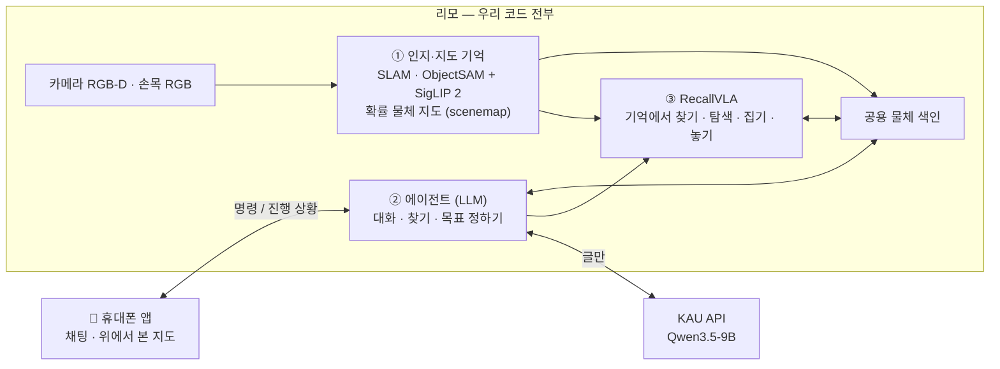

# 계획

무엇을 만들고, 어떻게 나뉘며, 무엇이 남았는지 정리한 문서다. 본문은 지금 계획만 적고, 바뀐 과정은 맨 아래 [변경 기록](#변경-기록)에 둔다.
부품마다 무엇을 골랐는지는 [모델 선택](model_selection.md), 저장소 구조는 [LAYOUT](LAYOUT.md), VLA 설계는 [map_vla](map_vla/README.md).

## 무엇을 만드나

사람이 휴대폰 채팅으로 말하면, 리모 + 로봇 팔이 **기억해 둔 물체 지도**를 보고 스스로 물건을 찾아 집어 옮긴다. 본 적 있는 물체는 기억에서 떠올려 바로 가고, 본 적 없는 물체는 탐색해서 찾는다.

> 나: "컵 식탁에 갖다 놔"
> 로봇: "컵 위치로 이동 중이에요" → "컵을 집었어요" → "컵을 식탁에 놨어요 ✅"

## 전체 구조

| 어디서 | 무엇을 |
|---|---|
| **리모** | 우리 코드 전부 — SLAM, 분할, 물체 기억, 에이전트, 실행기, RecallVLA |
| **KAU API** | Qwen3.5-9B (AI agent 수업 제공) |
| **개발·학습 PC** `jy-desktop` (RTX 5070 Ti 16 GB) | GPU 학습 환경, RecallVLA 학습, OmniGibson 시뮬, 뷰어 |
| **휴대폰** | 채팅 앱 — 명령하고 진행 상황을 받음 |
| **시뮬** | BEHAVIOR-1K 집 장면(OmniGibson) + GPU 일괄 환경. 리모 집기·놓기 학습장(대회 점수는 목표 아님) |

## 준비물

| 항목 | 내용 |
|---|---|
| 로봇 | AgileX 리모 **기본형 (가정)** — Jetson Nano 4 GB, 라이다 EAI X2L, RGB-D Orbbec DaBai, Ubuntu 18.04. **프로**를 받으면 Orin Nano 8 GB, ROS 2 Foxy 공식 지원 |
| 로봇 팔 | ROBOTIS **OMX-F** — 리모와 합친 URDF `src/robot/map_vla_description` (시뮬·학습·실기 모두 이것 하나) |
| NPU | DEEPX DX-M1 (보유) — VLA 가 리모에서 안 돌면 라즈베리파이 5 에 달아서 |
| LLM | 수업 KAU API — `https://agent.kau.ac.kr/v1`, `qwen3.5-9b` |
| 개발 PC | `jy-desktop` — Ubuntu 22.04, RTX 5070 Ti 16 GB, CUDA 12.8 |

## 원칙

- **코드는 C++ · CUDA · Rust.** 예외: 앱(Swift·Kotlin), 학습·데이터 변환 도구(Python), 외부 도구는 원래 언어.
- **저장소는 robot-agent 하나.** 코드는 git, 빌드 `build/`·모델 `models/`·데이터 `data/`·외부 `third_party/` 는 폴더 안(git 밖). 경로는 `config/paths.env` 하나, 빌드는 `tools/build_all.sh` 하나. 커밋 훅이 저장소 밖 경로를 막는다.
- **원본은 하나.** 인지·뷰어(`src/scene_graph`)가 바뀌면 실시간 로봇·학습 리플레이·학습 뷰어가 따라 바뀐다. 흉내 내거나 베낀 코드를 두지 않는다.
- **시뮬은 실제 로봇과 같은 방식으로 돈다.** 위치는 Cartographer(시뮬 2D 라이다 + 바퀴 오도메트리 — 실제 리모의 X2L 과 같은 입력), 이동 판정은 오도메트리. 정답 자세(`gt`)는 확인용.
- **학습도 실제와 같은 입력.** 정답 지도로 학습하지 않는다 — 빈 지도에서 로봇이 본 만큼 자라는 지도. 교사도 학생과 같은 입력(특권은 critic 만).
- **물체 사이 관계(위·안·옆)는 쓰지 않는다.** 위치·크기 숫자로 충분하다.

## 할 일

상태: ✅ 끝남 · 🔄 진행 중 · ⬜ 아직

### 1. 로봇 기본

| 할 일 | 내용 | 상태 |
|---|---|---|
| URDF | 리모 + OMX-F 합친 URDF, 시뮬(OmniGibson)·GPU 학습·뷰어가 같은 것을 저장소에서 빌드 | ✅ |
| ROS 2 올리기 | 이미 ROS 2 로 포팅된 리모 패키지를 찾아 쓴다([참고 자료](../refs/README.md#리모-ros-2-포팅된-것-찾기)) | ⬜ 로봇 받은 뒤 |
| TF·캘리브레이션 | `map → odom → base_link → camera/arm`, 카메라 내부 값·장착 위치, 손목 카메라 | ⬜ 로봇 받은 뒤 |
| 녹화 | 카메라·위치·관절을 ros2 bag 으로 — 다른 파트가 로봇 없이 실험 | ⬜ |

### 2. 인지·지도 기억 — `src/scene_graph/`

| 할 일 | 내용 | 상태 |
|---|---|---|
| 분할 | ObjectSAM(물체만, 벽·천장·바닥 안 자름) | ✅ |
| 이름·임베딩 | SigLIP 2 B/32 (C++/TensorRT, 마스크 풀링) | ✅ — 이름표를 순수 SigLIP 2 공간으로 바꾸는 중 🔄 |
| 확률 물체 지도 | 이름 없는 확률 DA, vMF 벡터, 베이지안 이름, 칼만 위치, 벽·천장 기하 거르기, 덜 본 정도 | ✅ 기본 켬 |
| SLAM | **Cartographer(2D 라이다)** 로 지도·위치 — libsgrt·realbag 기본(`SGRT_POSE=carto`), 시뮬 리모에 X2L 흉내 라이다, 임시 `slam2d` 는 archive. OpenLORIS 7 판 ATE 6.2 → 2.2 cm. 떠밀림 보정 json → GPU 지도(`slam_carto/calib/carto_drift.json`) | ✅ (실제 리모 기록 ⬜) |
| 방 나누기·이름 | 점유 격자로 방, 물체 이름 규칙 → 다음 임베딩 제로샷 | ✅ 규칙 / ⬜ 제로샷 |
| 지도 갱신 | 옮겨짐·사라짐·생김, 바뀐 부분만 | ✅ |
| 보기 | sgview — 실시간·기록 재생·학습 리플레이 공용, 본 곳만 그림 | ✅ |
| 리모 위 시간 | ObjectSAM·SigLIP 2·지도를 Jetson 에서 | ⬜ 로봇 받은 뒤 |

### 3. 에이전트 (LLM) — `src/agent/`

| 할 일 | 내용 | 상태 |
|---|---|---|
| 구조 | 스킬 = 지시문만, 코드는 `tools/`·`runtime/` | ✅ |
| 탐사 스킬 | `move_robot` 하나로 집 탐사(시뮬 두 집 접촉 0, 덮음 0.94–0.95) | ✅ |
| 물체 찾기 도구 | `search_objects`·`confirm_object`·`list_place` (이름 → 생김새 → 이름 고치기) | ✅ |
| 남은 도구 | `describe_object`·`set_plan`·`check`·`ask_user`·`report` — 설계만([agent plan](../src/agent/plan.md) 3.3) | ⬜ |
| 도구 수 | 지금 10 개, 원칙 8 개 이하 — 합칠지 결정 | ⬜ 결정 필요 |

### 4. RecallVLA — `training/`

| 할 일 | 내용 | 상태 |
|---|---|---|
| 신경망 | Qwen3.5-0.8B + SigLIP 2, 기억 요약 인코더, 행동 전문가, 커널 융합 | ✅ |
| GPU 학습 지도 | 확률 모드 구조로 다시 포팅 + 검출 흉내 층 + 입력 함수 하나(교사·학생·실기) + 집 전체 | 🔄 P1 끝 ([GPU_MAP_PORT](map_vla/GPU_MAP_PORT.md)) |
| 진짜 인지 비교 | OmniGibson + 진짜 파이프라인 대 GPU 지도, 입력 단위 비교 도구·기준값 | 🔄 |
| 명령 거르기 | 탐색으로 찾을 수 있는 물체만 명령에 | 🔄 |
| 교사 | 프런티어 탐사 교사, 강화학습 교사(행동 = 학생 입력, critic 만 특권), 대본 교사(지도에 확인된 물체만) | ⬜ 지도 포팅 뒤 |
| 커리큘럼 | ① 탐색해서 찾기 → ② 앞에서 집고 놓기 → ③ 둘 다 → ④ OmniGibson + 진짜 인지로 마지막 DAgger ([CURRICULUM](map_vla/CURRICULUM_BEHAVIOR2026.md) 5.7) | ⬜ |
| 학습 뷰어 | 실제 sgview 로 리플레이, 입력값·조건 패널, 리모·손목 카메라 | ✅ |
| 리모 위 실행 | 양자화 + C++/CUDA, 안 되면 라즈베리파이 5 + DX-M1 | ⬜ |

### 5. 앱 — `src/app/`

| 할 일 | 내용 | 상태 |
|---|---|---|
| 채팅 | iOS(SwiftUI)·Android(Compose), 카카오톡식, 지금은 로봇1 만 | ⬜ |
| 연결 | 앱 ↔ 리모 WebSocket, 학교 밖 접속 | ⬜ |
| 위에서 본 지도 | VLA 셋째 그림과 같은 정의. 물체를 누르면 id, 바닥을 누르면 지점 → 로봇이 놓을 수 있는지 확인 → 확인 단추 | ⬜ 설계만 |

### 6. 합치기와 평가

| 할 일 | 내용 | 상태 |
|---|---|---|
| 시뮬 전체 흐름 | 지도 기억 → 에이전트 → RecallVLA, 점수는 `slam` 판 | ⬜ |
| 전체 기능 점검 | 빌드·시험·CPU/GPU 일치·짧은 학습·인지 재생·뷰어·에이전트·시뮬을 한 번에 도는 점검 스크립트 | 🔄 |
| 실제 리모 | 같은 흐름을 리모에서, 앱으로 명령 | ⬜ |
| 점수 | 탐색해서 찾기·집기·놓기 성공률(학습 집 / 처음 보는 집), 바뀜 판정 정확도 | ⬜ |

---

## 아직 모르는 것 · 위험

| 무엇 | 왜 문제인가 | 어떻게 |
|---|---|---|
| 리모에서 다 돌까 | 4 GB 에 분할·SigLIP 2·지도·VLA 가 같이 | 재 보고 입력 해상도·양자화, 안 되면 DX-M1. 프로면 8 GB |
| 학습 지도와 실제 인지의 차이 | GPU 학습 지도는 흉내라 실제와 어긋날 수 있음 | 입력 단위 비교로 맞추고, 마지막 단계는 진짜 인지로 미세 조정 |
| 정밀한 집기 | GPU 환경의 잡기는 규칙 모델 | OmniGibson 물리로 마지막 단계, 실기 시연으로 보정 |
| 집 다양성 | 학습 집 4 채면 집 구조를 외울 수 있음 | 절차 생성 집(ProcTHOR) 섞기 |
| 리모 ROS 2 | 기본형은 Ubuntu 18.04 | 포팅된 것 찾기. 프로면 해결 |
| 기본형? 프로? | ROS·CUDA·TensorRT·라이다가 달라짐 | 두 쪽 다 되게 짜고 정해지면 고침 |
| 학교 밖 접속 | 앱과 API 를 밖에서 | VPN 등, 학교 규칙 확인 |

---

## 변경 기록

| 날짜 | 바뀐 것 | 이유 |
|---|---|---|
| 2026-09-30 | 계획 처음 작성. 리모 기본형 가정, 학교 4090, 물체 인식 YOLO-seg, DA·지도 갱신 직접, Spark-DSG, SLAM Cartographer, 시뮬 BEHAVIOR, LLM Qwen3.5-9B, 코드 C++·CUDA·Rust, 앱 네이티브, NPU DX-M1, 우리 코드는 전부 리모에서 | |
| 2026-10-02 | 보기 3D → 2D 지도. 리모 프로를 받을 수도 있음 | |
| 2026-10-03 | LLM = 수업 KAU API. 물체 인식 → FastSAM-s + SigLIP 2, 물체 찾기(임베딩 + 이름, RAG), 방 나누기 추가. 시뮬 2026 BEHAVIOR Challenge, 개발 PC 확정. URDF·TF·시뮬에 리모 넣기 추가. 원칙: 시뮬은 실제처럼(`slam`). VLA 를 직접 설계 | |
| 2026-10-04 | π0.5 버림 → 우리 VLA, 팔 OMX-F. 공개용 RecallVLA(Qwen3.5-0.8B + SigLIP 2) | 지도 기억을 넣고 리모에 맞추려고 |
| 2026-10-05 | 실제 bag(OpenLORIS·TUM)으로 확인. 분할 비교 뒤 ObjectSAM 으로 결정, 확률 물체 지도(objprob) 기본. 물체 찾기를 에이전트·RecallVLA 공용 색인으로 | FastSAM 조각·벽 문제, Jetson 계산량 |
| 2026-10-06 | 문서를 설계자 관점으로 다시 씀(지금 계획만 본문, 과정은 기록). 저장소 하나로 정리(옛 대회 저장소 분리, 인지·뷰어 원본을 robot-agent 로). 정답 지도 학습 금지와 새 커리큘럼, 교사 = 학생 입력, 학습 중 인지 = 검출 흉내 + GPU 확률 모드, SigLIP 2 공간 하나, 찾을 수 있는 물체만 명령. 평가는 리모 성공률(대회 점수 안 씀) | 학습과 실제가 같은 입력, 정리된 저장소 |
| 2026-10-06 | SLAM 을 Cartographer 로 바꿈(ROS 없는 코어 + C ABI, libsgrt·realbag 기본, 시뮬 2D 라이다), scenemap `slam2d` archive | 09-30 결정대로, OpenLORIS 에서 ATE·지도 모두 나음 |
